# DS Summary
## Chapter 1: Introduction

**Loose Definition:** A distributed system is a collection of interacting processes appearing as a single application to the end users.

**Definition:** A system where hardware and software components are located at netwrked computers, communicate and coordinate their actions ONLY by passing messages.

**Grid Computing:** A computational grid is a hardware and software infrastructure that provides dependable, consistent, pervasive, and inexpensive access to high-end computational capabilities.

**Cloud Computing:** Is grid computing plus virtualization, elasticity, and pay-as-you-go pricing.

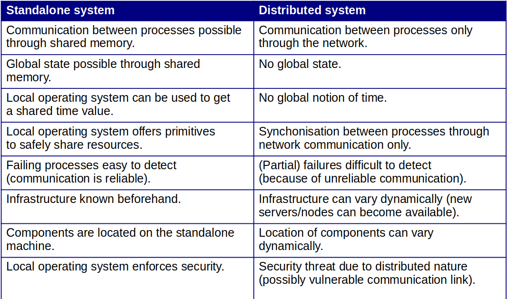

### Developing distributed systems

#### System Models

- **System models:** Capture non-functionals of the requirements related to distributed nature of the system.
- **Interaction models:** Can we give time guarantees on network communication/process execution?
  - **Synchronous** system
  - **Asynchronous** system
- **Failure models:** Which failures should the application cope with, how will we detect failures, and what will we do in case of failures?
  - **Process Omission failures:** a process does not fulfill a request.
  - **Channel Omission failures:** a communication link fails to deliver a message.
  - **Byzantine failures:** a process sends arbitrary messages.
  - **Timing failures:** a process violates its timing constraints.
    - **Solution:** heartbeat, timeout
- **Security models:** Who can do what in the system?
  - Interception of credentials
  - Impersonation
  - Copy, change, replay, create messages
  - **Solution:** encryption, authentication, authorization

#### Logical Architectures

- **Layered architecture:** Each layer provides services to the layer above it and uses services from the layer below it.
  - **+**: Reduced number of interfaces, dependencies.
  - **+**: Easy replacement of a layer.
  - **-**: Possible duplication of functionality.
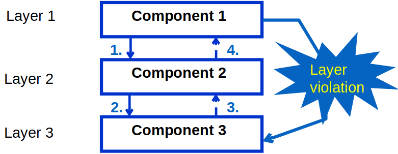

- **Object-based architecture:** Objects communicate by invoking methods on each other.
  - **+**: Encapsulation, reuse, flexibility.
  - **-**: Tight coupling, difficult to maintain.
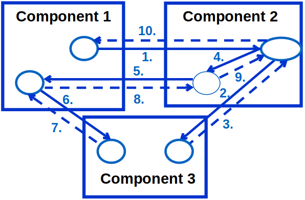

- **Event-based architecture:** Components communicate by sending events. "publish-subscribe"
  - **+**: Decoupling, flexibility.
  - **-**: Difficult to understand, debug, maintain.
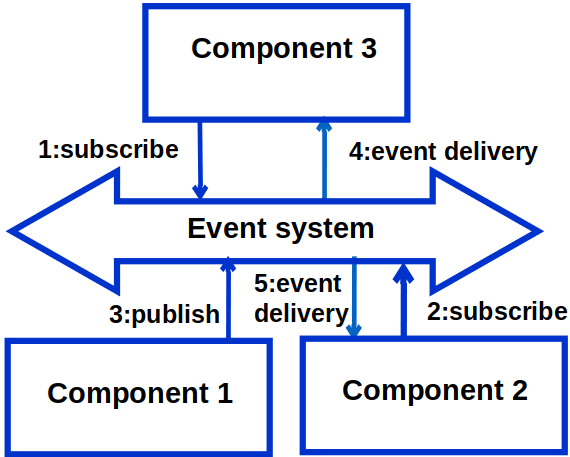

- **Data-centric architecture:** Components communicate by reading and writing shared data.
  - **+**: Decoupling, flexibility.
  - **-**: Possibly slow (central bottleneck, locking...).
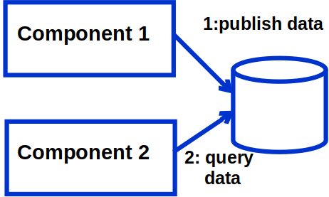

#### System Architectures

- **Client-server:** Client request services from server.

- **Client-multiple servers:** Client request services from multiple servers. (DNS based load balancing)
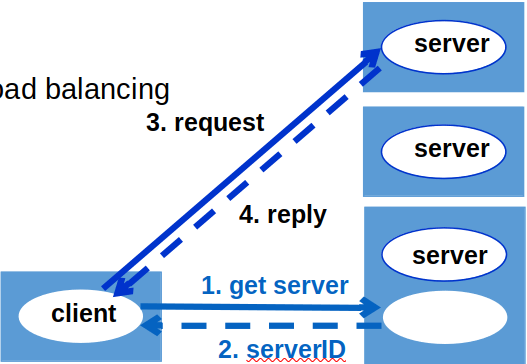

- **Client-multiple servers:** Client request services from multiple servers. (implicit server lookup)
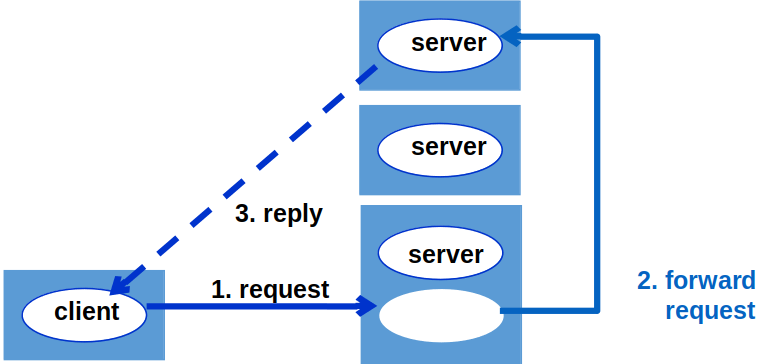

- **Proxy server:** Client request services from proxy server, which requests services from servers.
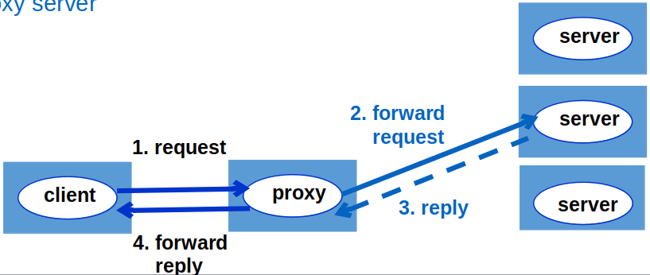

#### P2P Architectures

- **Unstructured P2P:** No organization, no central server.
  - Links have no other meaning that communication.
  - Unstructured search (flooding), this is resource consuming.
  - 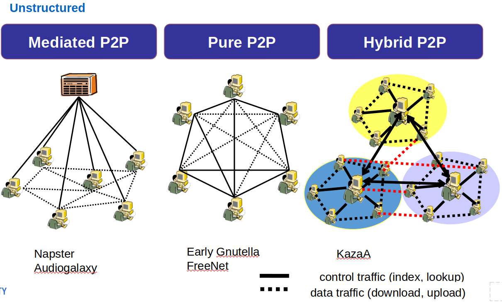
- **Structured P2P:** Organized, each node has a specific role.
  - Logical link has relation to service offered.
  - Structured search (DHT: Distributed hash table), this is efficient.
  - 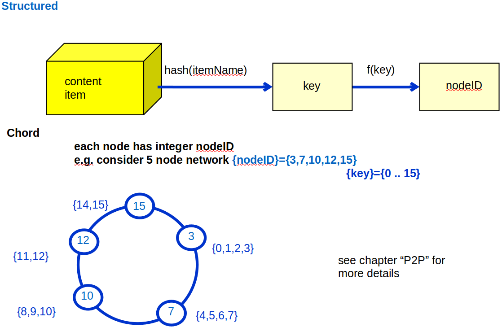

### Middleware

**Role:** Middleware is a software layer that provides a programming abstraction for distributed systems.

**Services:**
 - **Naming service:** Associate logical names to remote entities.
 - **Discovery and registration service:** Discover and register services.
 - **Transaction service:** Support distributed (database) transactions.
 - **Security service:** Provide security services.
 - **Event service:** Support event-based communication.
 - **Data replication service:** Replicate data for fault tolerance and optimize data access.
 - **Persistence service:** Transparently offer data persistence.
 - **Life cycle service:** Manage the life cycle of distributed objects.

### Cap Theorem

**CAP Theorem:** In a distributed system, it is impossible to simultaneously guarantee all three of the following:
 - **Consistency:** All read/write operations must result in a global consistent state.
 - **Availability:** All requests on non-failing nodes must get a response.
 - **Partition tolerance:** The system continues to operate despite network partitions.

### Strategies to avoid performance problems (just read this)

1. Keep complexity of client software as low as possible and put preferably as much as possible operations in the back-end.
2. Use caches when required, but the system should work perfectly as well without caches.
3. Make sure the system can reply fast to requests (i.e. avoid large-grain invocations, but split up in small-grain invocations).
4. To decouple systems, the use of queues is often useful (to easily add asynchronous processing).
5. Make sure the load balancing components work in a decent way (i.e. use appropriate load balancing algorithms).
6. Make sure to have very detailed log-files at all times (with different levels of details, to allow easy filtering), make it able to determine immediately the involved host, component, time stamps, and monitored values.
7. The detailed log-files should also contain failures, successful operations, response times and statistical processing should be done automatically (e.g. calculating averages, standard deviations, trends).
8. When the system runs, it should be able to cope with graceful shutdown of components (one by one).
9. The system should start up and work properly with zero-configuration: use good default values, use auto-discovery as much as possible.
10. To distribute load, make for instance use of a cluster management system or a cloud environment.

## Chapter 2: Middleware

### Remote Invocation
#### Requires:
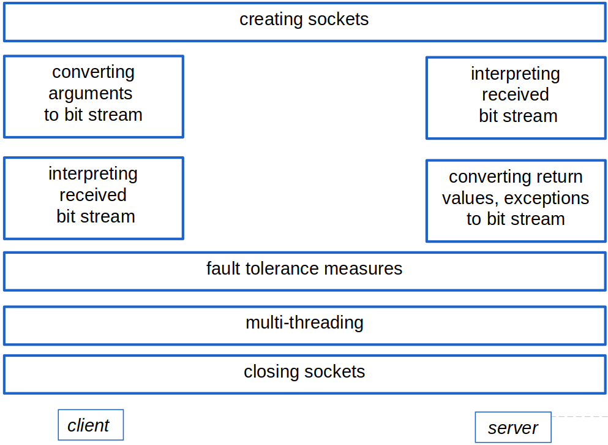
#### Positioning:
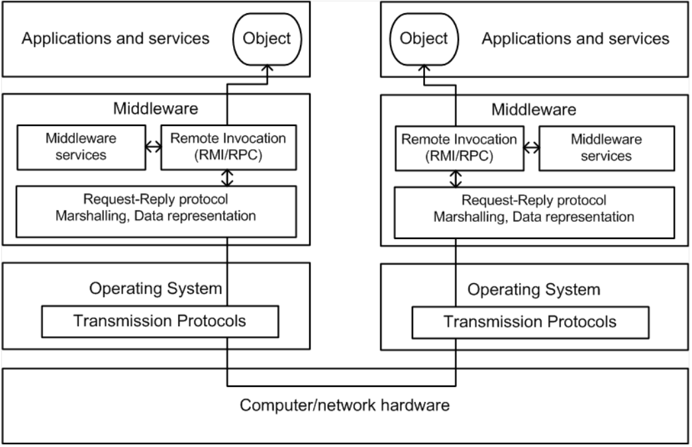
#### Local and remote invocations:

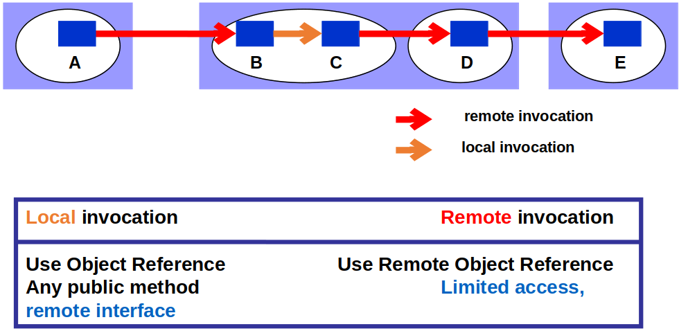

The goal of the remote invocation is to make the invocation of a method on a remote object look like a local invocation. This is done by the middleware.
It hides:
- Locate/contact the remote object.
- Marshalling (convert parameters to byte stream).
- Fault tolerance measures.
- Communication details.
But! The programmer must still be aware of the fact that the invocation is remote (network latency, possible failures). The typical approach is that the programmer has to catch exceptions that are thrown by the remote invocation.

#### Remote Object Reference (ROR)

Unique ID for objects in distributed systems. It is unique over time and space.

Host: Internet Address
Process: Port number + process creation time
Object: Object ID
Object type: Interface ID

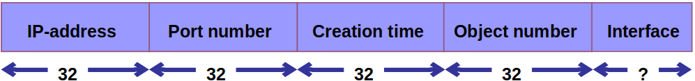

#### Fault Tolerance

**Techniques:**
  - Retry-request messages
  - Duplicate request filtering
  - Retransmission of results
    - Re-execute call
    - History table of results -> retransmit reply

**Invocation semantics:**
  - At most once
  - At least once
  - Exactly once
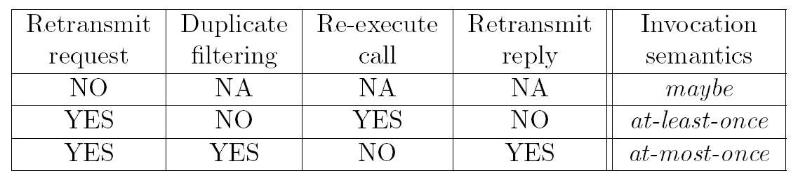

#### RMI architecture

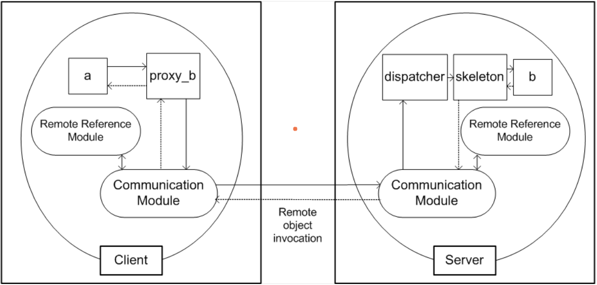

#### Request-reply (RR) protocol

Runs in the communication module. It is responsible for:

- send message to server object
- send back return value or exception info to requestor
- enforce appropriate invocation semantics

**Duplicate Filtering Algorithm:** The server keeps a history of the last N requests. If a request is received that is already in the history, the server sends back the result of the previous invocation.

#### Marshalling

Marshalling is the process of converting the parameters of a method call into a byte stream. The byte stream is sent over the network to the remote object. The remote object unmarshals the byte stream to get the parameters.

#### RMI binding service

The RMI binding service is a service that allows clients to look up remote objects by name. The binding service is a directory service that maps names to remote object references.
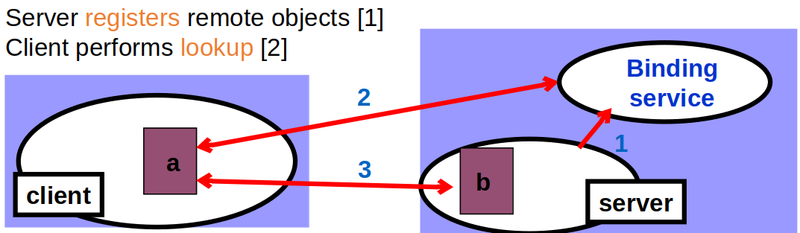

### Middleware services

#### Naming service

Registration of object references with names. The names are structured in a hierarchy.

#### Trading service

Comparable to the naming service, but lets the objects be located by attributes also.

#### Event service

Publish-subscribe model. The event service allows objects to subscribe to events and to publish events.

Notification: Object that contains information about the event.
Observer: decouple the object of interest from its subscribers.

#### Notification service

Extends the event service with filters. Notifications have a datatype, the consumers may use filters to specify events they are interested in. Proxies forwards notifications to consumers according to constraints specified in the filters.

#### Transaction service

A transaction is a sequence of operations that must be executed as a single unit. The transaction service provides the following properties:

- Atomicity: All operations in a transaction are executed or none.
- Consistency: A transaction transforms the system from one consistent state to another.

#### Persistence service

Automated storing and retrieving of objects.

#### Activation service

Activation: On demand execution of services to reduce server processes/threads. Activate objects when requests arrive. Passivate objects if in consistent state.

Activator: Keeps table of passive (activatable) objects. Activates objects on demand.

#### Load balancing service

Distribute the load over multiple servers. Often in combination with naming service.

## Chapter 3: Enterprise Applications

### JEE-based applications (Java Enterprise Edition)

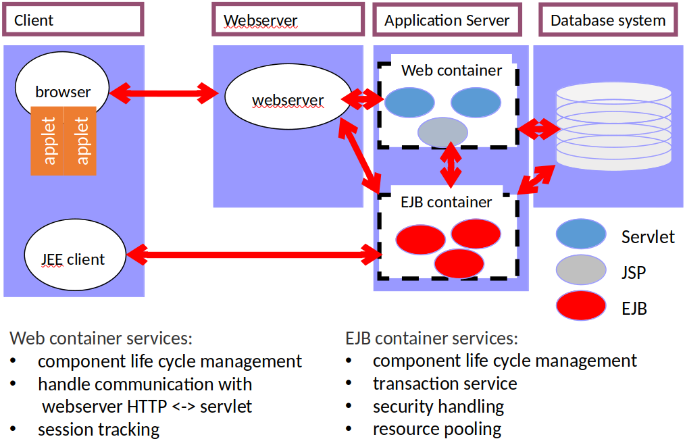

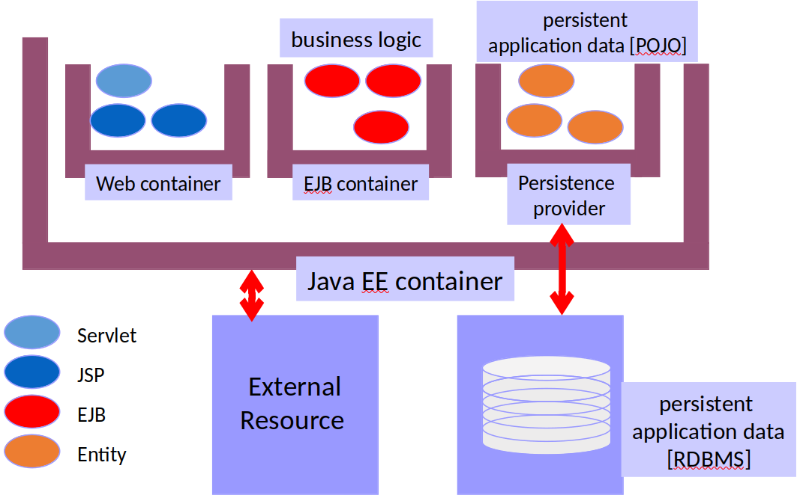

**Inversion of Control:** Decisions taken at the server side, not the client side. The container provides transparent features.

### Benefits

1. **Simplify the development of large, distributed applications.**
   1. The EJB container provides system-level services to enterprise beans.
   2. The bean developer can concentrate on solving business problems.
   3. The EJB container is responsible for system-level services such as transactions, management and security authentication.
2. **The client developer can focus on the presentation of the client.**
   1. Because the beans contain the business logic.
   2. The clients are thinner.
3. **Enterprise beans are portable/reusable components.**
   1. The application assembler can build new applications from existing beans.
   2. The applications can run on any compliant JEE server.

## Chapter 4: Timing and synchronization

### Physical clock synchronization

In distributed systems there is **no global state** notion. How can we be sure about event ordering when there is no global time notion?

There are two flavours of time:
- **Physical time:** Real time, related to solar time, this is important when a connection to the "real" time is needed.
- **Logical time:** Time that is related to the order of events in the system. This is easier to implement.

#### Hardware clocks
A hardware clock is made up of a crystal oscillator and a counter. The counter is incremented by the oscillator at a fixed rate. The counter is read by the operating system.

Hardware clocks are not perfect. They drift and skew. 
- The **drift rate** is the difference between the rate of the clock and the rate of the real time. 
- The **skew** is the difference between the time of the clock and the real time.

The clock resolution is the smallest time interval that can be measured by the clock = 1/H. With H the amount of times the clock is updated per second.

A correct clock has a bounded drift rate and the monotonicity property. The clock is correct if the time it shows is always greater than the time it showed before.

#### External synchronization

There is an external "authoritative" process clock that is used to synchronize the clocks of the other processes. The authoritative process sends a message to the other processes with the time it has. The other processes adjust their clocks to the time of the authoritative process.

All the clocks have a bound skew that needs to be smaller than a predifined value.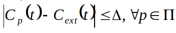 with pi the collection of clocks, without the external one.

#### Internal synchronization

Here the skew between any two clocks is bounded by a predefined value. The clocks are synchronized with each other.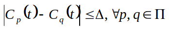with pi the collection of clocks.

#### Obvious property

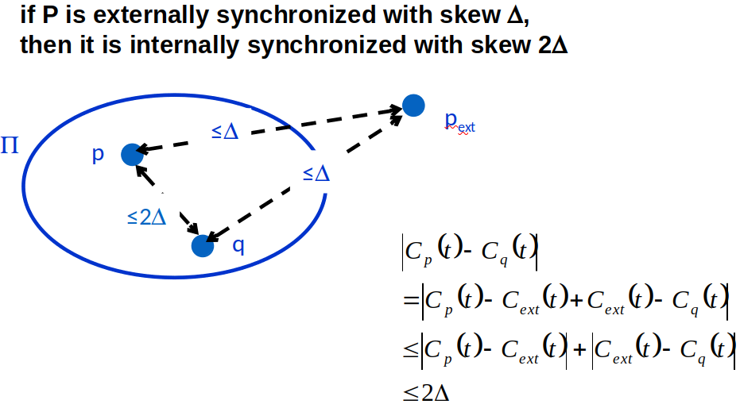

#### Client-server algorithm

Here the meaning of the client server is that one process (p) has a better clock than the other process (q). **The goal of the synchronization is to minimize the skew between the clocks of p and q.**

The problem with this is that when p sends its current time to q, the time it takes for the message to arrive is not taken into account.

**Synchronous system:** Here the time it takes for a message to arrive is bounded by two bounds, $\delta_{max}$ and $\delta_{min}$.

Estimate: $C_q = t_q + \frac{\delta_{min} + \delta_{max}}{2}$

Worst case we will have a skew of $\frac{\delta_{max} - \delta_{min}}{2}$.
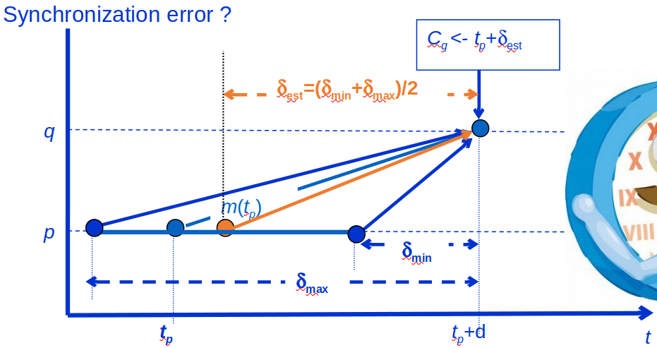

**Asynchronous system:** Here the time it takes for a message to arrive is not known, but we have an estimate of $\delta \approx RTT/2$. The RTT is the round trip time.

#### Cristian's algorithm (for asynchronous systems)

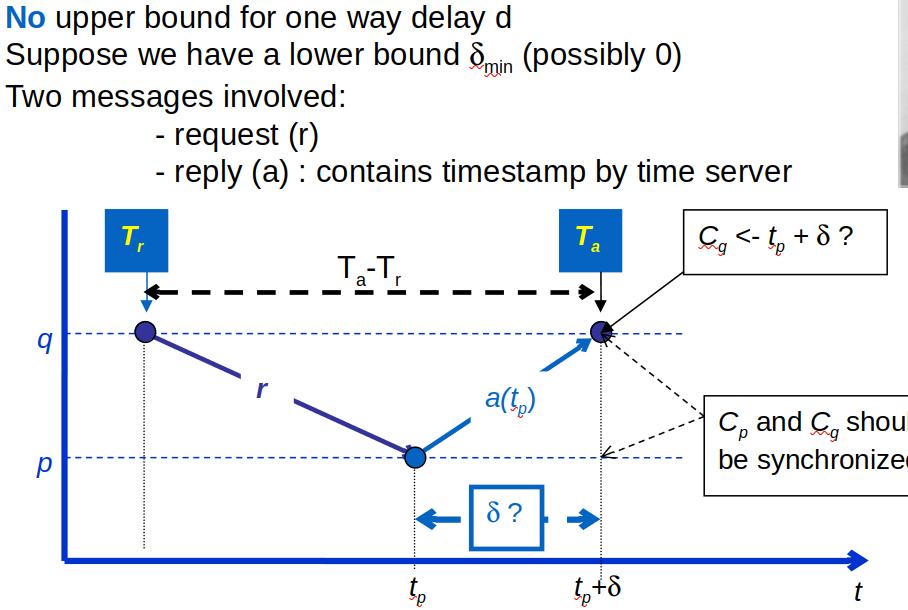

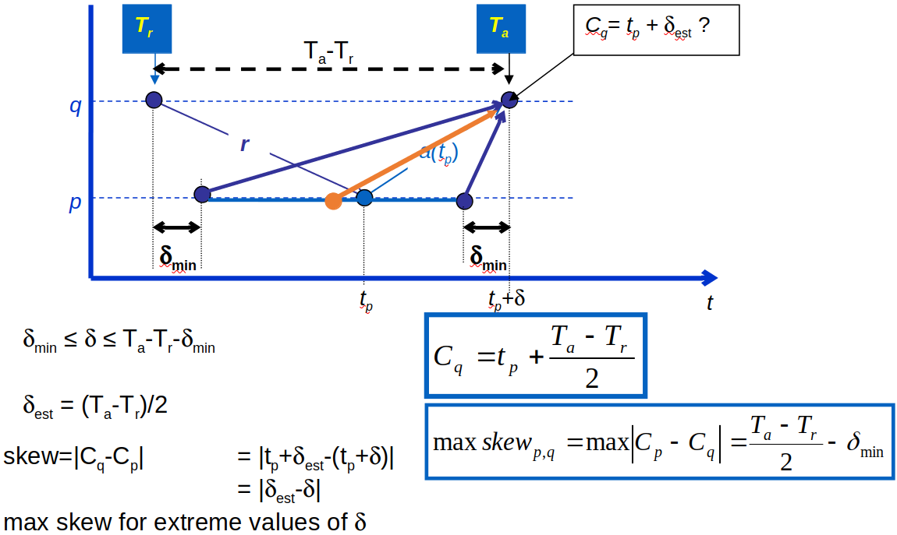

#### Peering algorithm: NTP (Network Time Protocol)

NTP is a protocol that is used to synchronize the clocks of computers over a network.

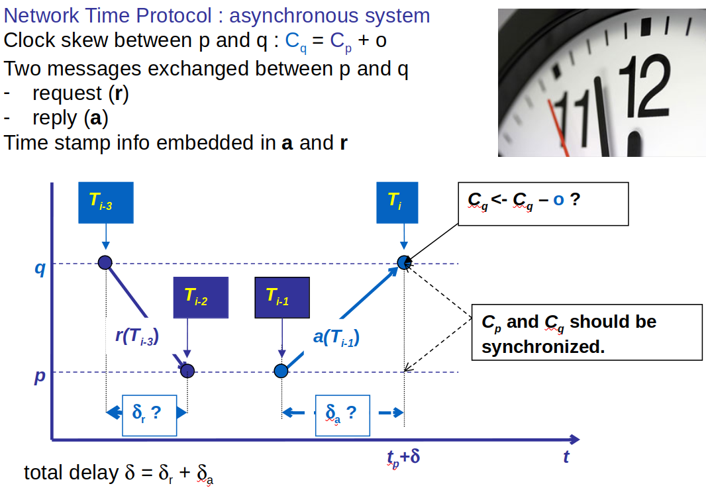

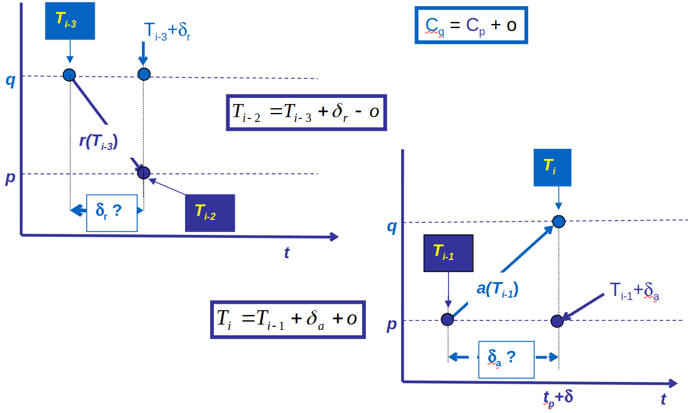

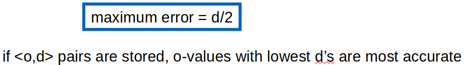

with d the delay = $\delta_r + \delta_a$.

#### NTP Modes

- **Multicast:** Used in high speed (low delay) LAN environments. The server multicasts the time to all clients. The clients then assume some average delay.
- **Procedure call:** Using Christian's algorithm. Better accuracy than multicast.
- **Symmetric:** Peering servers execute P2P algorithm. They collect 8 <o,d> pairs, using the optimal o based on minimal d. Used to achieve high accuracy.

#### Peering algorithm: Berkeley algorithm

The peering processes elect time server. This coordinator actively polls its clients (participants).

1. Poll for participant time.
2. Use Christian's algorithm to measure RTT.
3. Calculate the average RTT.
   1. But neglect participants with RTT > RTTmax.
   2. If the time between the two is bigger than a certain threshold, the coordinator will not use the participant.
   3. Send the adjustment to the participant.
4. Elect a new coordinator if the current one fails.
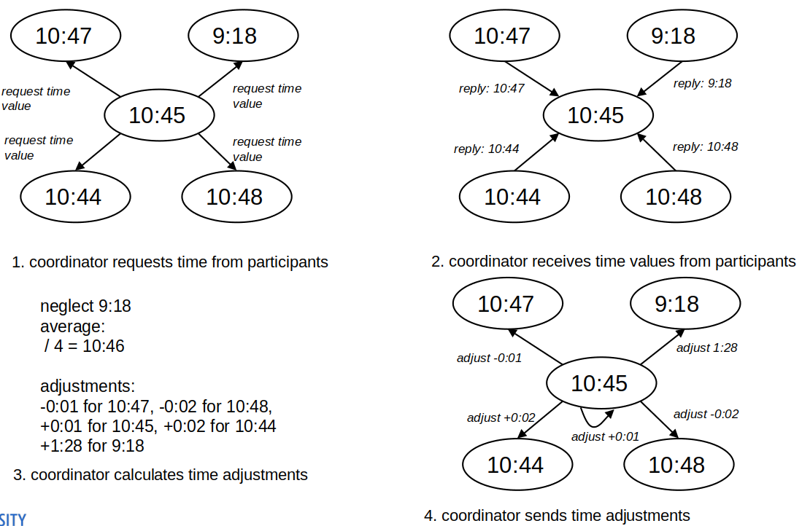
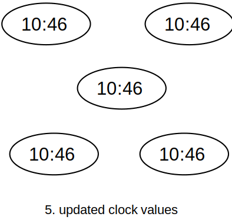

To make sure you have no negative adjustments, you just add up until all corrections are positive.

### Logical clocks