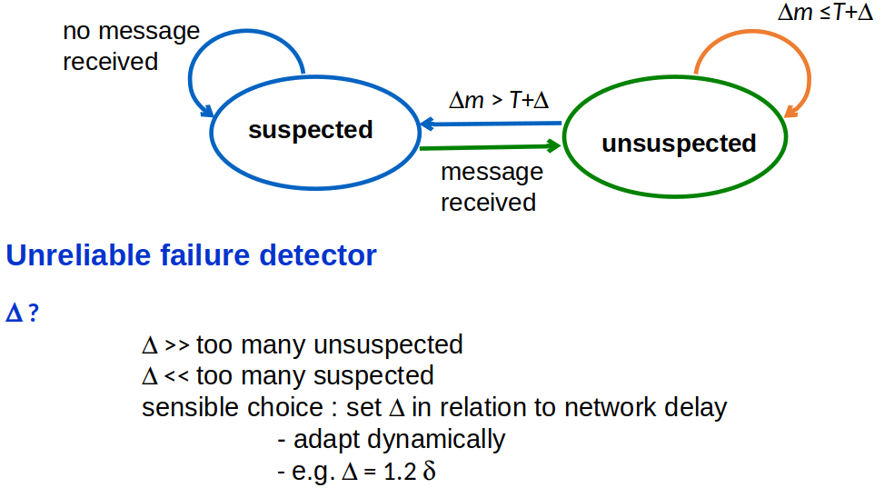
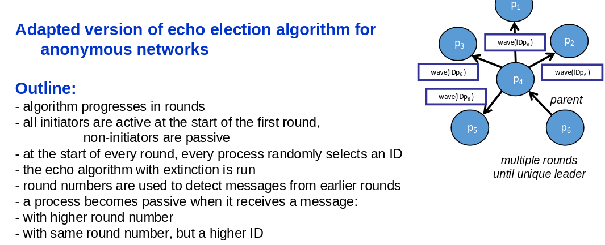

# *DS Summary*
# Chapter 1: Introduction

**Loose Definition:** A distributed system is a collection of interacting processes appearing as a single application to the end users.

**Definition:** A system where hardware and software components are located at netwrked computers, communicate and coordinate their actions ONLY by passing messages.

**Grid Computing:** A computational grid is a hardware and software infrastructure that provides dependable, consistent, pervasive, and inexpensive access to high-end computational capabilities.

**Cloud Computing:** Is grid computing plus virtualization, elasticity, and pay-as-you-go pricing.

## Developing distributed systems

### System Models

- **System models:** Capture non-functionals of the requirements related to distributed nature of the system.
- **Interaction models:** Can we give time guarantees on network communication/process execution?
  - **Synchronous** system
  - **Asynchronous** system
- **Failure models:** Which failures should the application cope with, how will we detect failures, and what will we do in case of failures?
  - **Process Omission failures:** a process does not fulfill a request.
  - **Channel Omission failures:** a communication link fails to deliver a message.
  - **Byzantine failures:** a process sends arbitrary messages.
  - **Timing failures:** a process violates its timing constraints.
    - **Solution:** heartbeat, timeout
- **Security models:** Who can do what in the system?
  - Interception of credentials
  - Impersonation
  - Copy, change, replay, create messages
  - **Solution:** encryption, authentication, authorization

### Logical Architectures

- **Layered architecture:** Each layer provides services to the layer above it and uses services from the layer below it.
  - **+**: Reduced number of interfaces, dependencies.
  - **+**: Easy replacement of a layer.
  - **-**: Possible duplication of functionality.

- **Object-based architecture:** Objects communicate by invoking methods on each other.
  - **+**: Encapsulation, reuse, flexibility.
  - **-**: Tight coupling, difficult to maintain.

- **Event-based architecture:** Components communicate by sending events. "publish-subscribe"
  - **+**: Decoupling, flexibility.
  - **-**: Difficult to understand, debug, maintain.

- **Data-centric architecture:** Components communicate by reading and writing shared data.
  - **+**: Decoupling, flexibility.
  - **-**: Possibly slow (central bottleneck, locking...).

### System Architectures

- **Client-server:** Client request services from server.

- **Client-multiple servers:** Client request services from multiple servers. (DNS based load balancing)

- **Client-multiple servers:** Client request services from multiple servers. (implicit server lookup)

- **Proxy server:** Client request services from proxy server, which requests services from servers.

### P2P Architectures

- **Unstructured P2P:** No organization, no central server.
  - Links have no other meaning that communication.
  - Unstructured search (flooding), this is resource consuming.
  - 
- **Structured P2P:** Organized, each node has a specific role.
  - Logical link has relation to service offered.
  - Structured search (DHT: Distributed hash table), this is efficient.
  - 

## Middleware

**Role:** Middleware is a software layer that provides a programming abstraction for distributed systems.

**Services:**
 - **Naming service:** Associate logical names to remote entities.
 - **Discovery and registration service:** Discover and register services.
 - **Transaction service:** Support distributed (database) transactions.
 - **Security service:** Provide security services.
 - **Event service:** Support event-based communication.
 - **Data replication service:** Replicate data for fault tolerance and optimize data access.
 - **Persistence service:** Transparently offer data persistence.
 - **Life cycle service:** Manage the life cycle of distributed objects.

## Cap Theorem

**CAP Theorem:** In a distributed system, it is impossible to simultaneously guarantee all three of the following:
 - **Consistency:** All read/write operations must result in a global consistent state.
 - **Availability:** All requests on non-failing nodes must get a response.
 - **Partition tolerance:** The system continues to operate despite network partitions.

## Strategies to avoid performance problems (just read this)

1. Keep complexity of client software as low as possible and put preferably as much as possible operations in the back-end.
2. Use caches when required, but the system should work perfectly as well without caches.
3. Make sure the system can reply fast to requests (i.e. avoid large-grain invocations, but split up in small-grain invocations).
4. To decouple systems, the use of queues is often useful (to easily add asynchronous processing).
5. Make sure the load balancing components work in a decent way (i.e. use appropriate load balancing algorithms).
6. Make sure to have very detailed log-files at all times (with different levels of details, to allow easy filtering), make it able to determine immediately the involved host, component, time stamps, and monitored values.
7. The detailed log-files should also contain failures, successful operations, response times and statistical processing should be done automatically (e.g. calculating averages, standard deviations, trends).
8. When the system runs, it should be able to cope with graceful shutdown of components (one by one).
9. The system should start up and work properly with zero-configuration: use good default values, use auto-discovery as much as possible.
10. To distribute load, make for instance use of a cluster management system or a cloud environment.

# Chapter 2: Middleware

## Remote Invocation
### Requires:

### Positioning:

### Local and remote invocations:

The goal of the remote invocation is to make the invocation of a method on a remote object look like a local invocation. This is done by the middleware.
It hides:
- Locate/contact the remote object.
- Marshalling (convert parameters to byte stream).
- Fault tolerance measures.
- Communication details.
But! The programmer must still be aware of the fact that the invocation is remote (network latency, possible failures). The typical approach is that the programmer has to catch exceptions that are thrown by the remote invocation.

### Remote Object Reference (ROR)

Unique ID for objects in distributed systems. It is unique over time and space.

Host: Internet Address
Process: Port number + process creation time
Object: Object ID
Object type: Interface ID

### Fault Tolerance

**Techniques:**
  - Retry-request messages
  - Duplicate request filtering
  - Retransmission of results
    - Re-execute call
    - History table of results -> retransmit reply

**Invocation semantics:**
  - At most once
  - At least once
  - Exactly once

#### RMI architecture

### Request-reply (RR) protocol

Runs in the communication module. It is responsible for:

- send message to server object
- send back return value or exception info to requestor
- enforce appropriate invocation semantics

**Duplicate Filtering Algorithm:** The server keeps a history of the last N requests. If a request is received that is already in the history, the server sends back the result of the previous invocation.

### Marshalling

Marshalling is the process of converting the parameters of a method call into a byte stream. The byte stream is sent over the network to the remote object. The remote object unmarshals the byte stream to get the parameters.

### RMI binding service

The RMI binding service is a service that allows clients to look up remote objects by name. The binding service is a directory service that maps names to remote object references.

## Middleware services

### Naming service

Registration of object references with names. The names are structured in a hierarchy.

### Trading service

Comparable to the naming service, but lets the objects be located by attributes also.

### Event service

Publish-subscribe model. The event service allows objects to subscribe to events and to publish events.

Notification: Object that contains information about the event.
Observer: decouple the object of interest from its subscribers.

### Notification service

Extends the event service with filters. Notifications have a datatype, the consumers may use filters to specify events they are interested in. Proxies forwards notifications to consumers according to constraints specified in the filters.

### Transaction service

A transaction is a sequence of operations that must be executed as a single unit. The transaction service provides the following properties:

- Atomicity: All operations in a transaction are executed or none.
- Consistency: A transaction transforms the system from one consistent state to another.

### Persistence service

Automated storing and retrieving of objects.

### Activation service

Activation: On demand execution of services to reduce server processes/threads. Activate objects when requests arrive. Passivate objects if in consistent state.

Activator: Keeps table of passive (activatable) objects. Activates objects on demand.

### Load balancing service

Distribute the load over multiple servers. Often in combination with naming service.

# Chapter 3: Enterprise Applications

## JEE-based applications (Java Enterprise Edition)

**Inversion of Control:** Decisions taken at the server side, not the client side. The container provides transparent features.

## Benefits

1. **Simplify the development of large, distributed applications.**
   1. The EJB container provides system-level services to enterprise beans.
   2. The bean developer can concentrate on solving business problems.
   3. The EJB container is responsible for system-level services such as transactions, management and security authentication.
2. **The client developer can focus on the presentation of the client.**
   1. Because the beans contain the business logic.
   2. The clients are thinner.
3. **Enterprise beans are portable/reusable components.**
   1. The application assembler can build new applications from existing beans.
   2. The applications can run on any compliant JEE server.

# Chapter 4: Timing and synchronization

## Physical clock synchronization

In distributed systems there is **no global state** notion. How can we be sure about event ordering when there is no global time notion?

There are two flavours of time:
- **Physical time:** Real time, related to solar time, this is important when a connection to the "real" time is needed.
- **Logical time:** Time that is related to the order of events in the system. This is easier to implement.

#### Hardware clocks
A hardware clock is made up of a crystal oscillator and a counter. The counter is incremented by the oscillator at a fixed rate. The counter is read by the operating system.

Hardware clocks are not perfect. They drift and skew. 
- The **drift rate** is the difference between the rate of the clock and the rate of the real time. 
- The **skew** is the difference between the time of the clock and the real time.

The clock resolution is the smallest time interval that can be measured by the clock = 1/H. With H the amount of times the clock is updated per second.

A correct clock has a bounded drift rate and the monotonicity property. The clock is correct if the time it shows is always greater than the time it showed before.

### External synchronization

There is an external "authoritative" process clock that is used to synchronize the clocks of the other processes. The authoritative process sends a message to the other processes with the time it has. The other processes adjust their clocks to the time of the authoritative process.

All the clocks have a bound skew that needs to be smaller than a predifined value. with pi the collection of clocks, without the external one.

### Internal synchronization

Here the skew between any two clocks is bounded by a predefined value. The clocks are synchronized with each other.with pi the collection of clocks.

### Obvious property

### Client-server algorithm

Here the meaning of the client server is that one process (p) has a better clock than the other process (q). **The goal of the synchronization is to minimize the skew between the clocks of p and q.**

The problem with this is that when p sends its current time to q, the time it takes for the message to arrive is not taken into account.

**Synchronous system:** Here the time it takes for a message to arrive is bounded by two bounds, $\delta_{max}$ and $\delta_{min}$.

Estimate: $C_q = t_q + \frac{\delta_{min} + \delta_{max}}{2}$

Worst case we will have a skew of $\frac{\delta_{max} - \delta_{min}}{2}$.

**Asynchronous system:** Here the time it takes for a message to arrive is not known, but we have an estimate of $\delta \approx RTT/2$. The RTT is the round trip time.

### Cristian's algorithm (for asynchronous systems)

### Peering algorithm: NTP (Network Time Protocol)

NTP is a protocol that is used to synchronize the clocks of computers over a network.

with d the delay = $\delta_r + \delta_a$.

### NTP Modes

- **Multicast:** Used in high speed (low delay) LAN environments. The server multicasts the time to all clients. The clients then assume some average delay.
- **Procedure call:** Using Christian's algorithm. Better accuracy than multicast.
- **Symmetric:** Peering servers execute P2P algorithm. They collect 8 <o,d> pairs, using the optimal o based on minimal d. Used to achieve high accuracy.

### Peering algorithm: Berkeley algorithm

The peering processes elect time server. This coordinator actively polls its clients (participants).

1. Poll for participant time.
2. Use Christian's algorithm to measure RTT.
3. Calculate the average RTT.
   1. But neglect participants with RTT > RTTmax.
   2. If the time between the two is bigger than a certain threshold, the coordinator will not use the participant.
   3. Send the adjustment to the participant.
4. Elect a new coordinator if the current one fails.

To make sure you have no negative adjustments, you just add up until all corrections are positive.

## Logical clocks

Logical clocks are used to order events in a distributed system. They are not related to physical time.

Event ordering is easy when the events happen in the same process. But when the events happen in different processes, it is more difficult.

How can we order events in a distributed system?

First some common sense about ordering events (->):
1. if both event belong to the same process, global ordering coincides with local ordering.
2. Sending a message happens before resceiving a message.
3. $(a \rightarrow b) AND (b \rightarrow c) \Rightarrow (a \rightarrow c)$

Events are **concurrent** if no chain of events can be found between the two events.

**causality:** $e \rightarrow e'$ doesn't mean that e causes e', it means that e' doesn't cause e.

To really determine if e causes e', we need a clock.

### Lamport's logical clocks

Each process $p_i$ maintains a scalar $L_i$ with initial value 0. This value is increased monotonically just before an event happens. If there is no communication between events, we have the following situation.

In situations where there is communication between events, we have the following situation.
First the sender of the event sends the value of its clock to the receiver. The receiver then sets its clock to the maximum of its own clock and the received clock + 1. Creating the following:

Lamport's clock just keeps track of the maximum amount of events seen at a process from any process in P.

### Vector clocks

Keep track of the number of events seen from each process individually. Each process has a vector $V_p$ of N elements.

If an event has a clock value, indicating it has seen more events from every process than another event, THEN we are sure that the event has happened after the other event.

**drawbacks:** There is more data exchanged and the number of processes needs to be known.

## Performance metrics

**Response Time:** A function of the number of simultaneous requests and the time it takes to process a request.

$T_{wait}$ is the time spent in queue before a serving thread can be created.
$T_{forw}, T_{backw}$ are the delays of the sum of the link delays on the path from the client to the server and back. That **link delay** consists of the processing delay, queuing delay, transmission delay and propagation delay.

- **Processing delay:** The time it takes to process a request until the packet is assigned to the output queue.
- **Queuing delay:** The time it takes for the packet to wait in the queue.
- **Transmission delay:** The time it takes to transmit the packet over the link.
- **Propagation delay:** The time it takes for the packet to travel from the sender to the receiver.

**Throughput:** The maximum number of simultaneous requests per second.

# Chapter 5: Coordination

In a distributed system, how to coordinate actions and the global state (shared variables)?

## Failure detection

**Unreliable failure detectors:** Only hints about the failure of a process. 
  - **suspected:** The process is probably crashed.
  - **unsuspected:** The process is probably alive.

**Reliable failure detectors:** Sure about crashing of a process.
  - **failed:** The process has definitely crashed.
  - **unsuspected:** The process is probably still alive.

### Algorithms

1. Hearth beat from p
2. Server polls p

**Hearth beat:** p sends a message m to q every T seconds. q measures IAT of m : $\Delta m$.

**Synchronous**

The bounded network delay $\delta < \Delta$ and the message is delivered.

**Asynchronous**

Here we can make no assumption on network delay. Only suspicion if $\Delta m$ becomes exceedingly large.

## Mutual exclusion

**Critical section:** A part of the code that can only be executed by one process at a time.

The goal is to coordinate process access to shared resources.

In the distributed case, this can only be done by message passing.

**Consider:** N processes with NO shared variables. They access common resources in a critical section. It is an asynchronous system and all the processes can communicate with each other.

**Failure model:** They use reliable channels, there are no process failures and the processes are well-behaved (they have no bad intentions).

A Good solution should contain the following properties:

1. **Safety [REQUIRED]:** At most one process is in the critical section.
2. **Liveness [REQUIRED]:** If a process wants to enter the critical section, it will eventually do so.
3. **Fairness [BONUS]:** Use logical clock to order access requests.

How will we quantify the solution quality?
Evaluation metrics:

- **Bandwith consumption:** The number of messages sent.
- **Client delay:** The time it takes for a client to enter the critical section, measured in an **UNLOADED** system.
- **System throughput:** The number of processes that can enter the critical section in a given time period. However this depends on the resource access time. A derived measure is the: 
  - **Synchonization delay** which is the time it takes for a process to enter the critical section, measured in a **LOADED** system.

### Centralized algorithm

One process is the coordinator. The coordinator decides who can enter the critical section. This is easy to implement but not very scalable.

#### Algo OK?

- **Safety:** OK -> guarded by token variable
- **Liveness:** OK -> Request to enter: all processes eventually leave, each leave dequeues a message from Q. If oldest request is dequeued, every request eventually handled. Request to leave: no permission needed to leave.
- **Fairness:** OK -> FIFO queue

#### Algo efficiency?

**Bandwith:** 2 messages/enter, 1 message/leave
**Client delay:** $2\delta$(=RTT)/enter, 0/leave
**System throughput:** 1/RTT

### Ring-based algorithm

Processes are organized in a ring. The token is passed from process to process. The process that has the token can enter the critical section.

#### Algo OK?

- **Safety:** OK -> Process can only send the token if it has received the token.
- **Liveness:** OK -> Token circulates in the ring, no starvation.
- **Fairness:** Not guaranteed -> Process needs luck for early access, the order is not based on request time.

#### Algo efficiency?

**Bandwith:** Worst case: N messages, Best case: 1 message, Average case: $(N+1)/2$ messages.

**Client delay:** Worst case: $N\delta$, Best case: $0\delta$ -> you just get the token, so no waiting, Average case: $N\delta/2$

**Synchonization delay:** Worst case: $N\delta$, Best case: $\delta$, Average case: $(N+1)\delta/2$

### Multicast: Ricart-Agrawala algorithm

Processes send a request to all other processes. They can enter the critical section if they have received a reply from all other processes. They can use multicast to reduce bandwidth. Use a Lamport clock to order the requests.

Each process has:
- **State variable:** Released, wanted and Held.
- **Lamport clock:** To order requests.
- **Request queue:** To store pending requests. This queue is organized using the lamport clock, each request contains the following: <p, T>.

#### Algo OK?

- **Safety:** OK -> The proof shows that p and q cannot be executing simultaneously in the CS.
- **Liveness:** OK -> Every request is eventually handled. Meaning that every process will eventually receive (N-1) answers.
- **Fairness:** OK -> The order of the requests is based on the Lamport clock.

#### Algo efficiency?

**Bandwith:** N(=1 if multicast is supported) messages/request, (N-1) message/reply. No message needed for leaving (= it is just the reply to the request of the following process that wants the CS).

**Client delay:** $2\delta$ for enter, $0\delta$ for leaving.

**Synchonization delay:** $\delta$. The time it takes for a process to enter the critical section, measured in a **LOADED** system.

### Multicast: Maekawa voting algorithm

Processes are organized in a grid. Each process can enter the critical section if it has received a reply from a majority of the processes in its column and row. This means that not all processes need to reply.

Voting set size:

#### Algo OK?

- **Safety:** OK -> The proof shows that p and q cannot be executing simultaneously in the CS.
- **Liveness:** Deadlock prone -> Use the Lamport clock to organize Q.
- **Fairness:** OK -> The order of the requests is based on the Lamport clock.

#### Algo efficiency?

**Bandwith:** K request messages, K reply messages. K release messages.

**Client delay:** $2\delta$ for enter, $0\delta$ for leaving.

**Synchonization delay:** $2\delta$. The release and reply message delays summed together.

#### Difference between Ricart-Agrawala and Maekawa

Maekawa:
- Additional state variable per process needed: Voting.
- Multicast request to enter to voting set only.
- Explicit leave needed, so voting processes can vote for other process.

Needs also another type of message: **release**.

### Summary of 4 algorithms

### Suzuki-Kasami algorithm

Completed connected network of processes, token is passed between processes. The process that has the token can enter the critical section.

To enter the CS: N-1 messages with the request, receive 1 message with token = N messages.

### Raymond's algorithm

Processes connected through tree topology, the token is passed between processes.

The process that holds the token is the root of the tree.

### Group mutual exclusion

## Election algorithms

**Goal:** Elect a coordinator in a distributed system.

**Correctness requirements:** 
- **Safety [REQUIRED]:** Only one process is elected.
- **Liveness [REQUIRED]:** Eventually a process is elected.

**Evaluation metrics:**

- **Bandwith:** The number of messages sent in the election process.
- **Turn around time:** Time needed for election round.

### Chang-Roberts: Ring-based algorithm

Processes are organized in a ring. The process with the highest ID is elected as the coordinator.

#### Algo OK?

- **Safety:** OK -> Only one process is elected. But IDs need to be unique!
- **Liveness:** OK -> No failures, messages are allowed to circulate.

#### Algo efficiency?

### Garcia-Molina: Bully algorithm

The **Garcia-Molina Bully Algorithm** is a distributed algorithm used for leader election in distributed systems. It ensures that the process with the highest ID becomes the leader. Here's a concise summary of how it works:

1. **Election Initiation**: When a process detects that the current leader has failed, it starts an election by sending election messages to all processes with higher IDs.

2. **Responses**:
   - If a higher-ID process responds, it takes over the election process by sending election messages to processes with IDs higher than its own.
   - If no higher-ID process responds, the initiating process declares itself the leader.

3. **Leader Announcement**: Once a leader is elected, it announces itself to all processes in the system.

The algorithm assumes that:
- Processes can communicate reliably.
- Every process knows the IDs of all other processes.
- Failure detection is available to identify leader failure.

#### Algo OK?

- **Safety:** OK if there is no process replacement.
- **Liveness:** OK -> messages delivered reliably.

### Franklin's algorithm

Variant of Chang Roberts algorithm. It uses a bidirectional communication ring. Nodes are active or passive, initially all nodes are active. (We all know how it works).

#### Algo performance

$1+\log_{2}N$ are needed to elect an unique leader. $log_2N$ are needed to elect a leader in a ring and then one round to announce the leader.

### Peterson's algorithm

Peterson's algorithm, as explained in the slides, is a **variant of the Chang-Roberts Election Algorithm** that operates in a unidirectional ring topology, using **aliases** for leader election. It differs in how it determines the leader and handles communication in rounds.

#### Key Elements:
1. **Alias System:** Each process has an alias, which can change during the election process.
2. **Unidirectional Communication:** Processes communicate in one direction around the ring.
3. **Active and Passive Nodes:**
   - **Active nodes** participate in the election process.
   - **Passive nodes** only forward messages.

#### Algorithm Outline:
1. **Initialization:**
   - Initially, all nodes are active.
   - Each process `i` sends its alias to its successor and receives the alias from its predecessor.

2. **Round Logic:**
   - If a process receives an alias equal to its own, it becomes the leader.
   - If the received alias is different:
     - The process forwards the alias to its successor.
     - It also receives an alias from the predecessor of its predecessor.
   - The process updates its alias if:
     - The received alias is greater than the maximum of its own alias and the alias two steps behind.
     - Otherwise, the process becomes passive.

3. **Termination:**
   - When only one active process remains (i.e., it receives its own alias), it declares itself the leader.

#### Performance:
- Similar to **Franklin’s algorithm**, it requires `1 + log₂(N)` rounds to elect a leader in a ring with `N` processes.
- Despite the unidirectional communication, the total number of messages exchanged is comparable to the bidirectional Franklin's algorithm.

This approach efficiently narrows down active participants while leveraging the alias system to identify a unique leader, demonstrating a robust adaptation of ring-based election protocols.

### Dolev-Klawe-Rodeh algorithm

Same approach as Peterson's algorithm, but with a different way of updating the alias. It uses a special leader message to announce the leader.

### Tree election algorithm

1. **Topology:** The processes form an acyclic graph (tree structure). Each node maintains:
   - A **list of child nodes** (can be empty).
   - A **parent link** (except for the root).

2. **Algorithm Outline:**
   - **Information Collection:**
     - Each node gathers the IDs of its child nodes.
     - Computes the maximum of its children’s IDs and its own ID.
     - Passes this maximum value up to its parent node.
   - **Leader Identification:**
     - The root node collects all maximum values from its children.
     - Determines the leader by identifying the largest ID in the tree.
   - **Leader Announcement:**
     - The root node sends the leader ID back down to all nodes in the tree.

3. **Initialization:**
   - The algorithm is typically started by **leaf nodes**, which report their IDs up the tree.

4. **Key Properties:**
   - **Safety:** Ensures only one leader is elected (the node with the highest ID).
   - **Efficiency:** Communication complexity is proportional to the number of edges in the tree.

5. **Advantages:**
   - Suited for hierarchical or tree-structured systems.
   - Efficient for large systems where tree-based communication minimizes message overhead.

### Echo algorithm with extinction

The **Echo Algorithm with Extinction** is a leader election algorithm designed for arbitrary networks and works by initiating and propagating "waves" of messages to identify a unique leader.

1. **Topology:** Works on **any** network graph, not restricted to a specific structure like a tree or ring.

2. **Algorithm Outline:**
   - **Wave Initiation:**
     - Multiple nodes may initiate a "wave" with a unique ID (typically their own).
     - Each wave is tagged with the ID of the initiating node.
   - **Message Propagation:**
     - Nodes forward wave messages to their neighbors.
     - If a node receives a wave with a higher ID than the one it is currently participating in, it switches to the higher ID and abandons the lower-ID wave.
     - If a node receives waves with lower IDs than its current wave, it drops those messages.
   - **Wave Completion:**
     - The wave with the largest ID propagates through the entire network.
     - Non-initiating nodes join the wave with the largest ID and ignore others.
   - **Leader Announcement:**
     - The node that initiated the wave with the largest ID is declared the leader.

3. **Key Properties:**
   - **Extinction Mechanism:** Lower-ID waves are gradually "extinguished" as nodes only participate in waves with the highest ID encountered.
   - **Safety:** Ensures only one leader (the node with the largest ID) is elected.
   - **Liveness:** Guarantees all nodes eventually participate in the wave with the largest ID.

4. **Performance:**
   - Message complexity: At most $O(N \times E)$, where $N$ is the number of nodes and $E$ is the number of edges.
   - Efficient for dense or arbitrary networks where multiple waves need to be resolved.

5. **Advantages:**
   - Handles dynamic and arbitrary network topologies.
   - Robust to multiple simultaneous initiators.

The Echo Algorithm with Extinction ensures that the largest-ID wave completes, electing a single leader efficiently while minimizing the impact of redundant messages from smaller-ID waves.

### Minimum spanning tree

Here we first make the MST using Kruskal, in the distributed case we need to know what nodes are in the same tree and whether an edge is an outgoing edge of the tree. Because of this, the nodes need to work together to find the least weight outgoing edge. When we have the MST, we can determine the node with the largest ID and elect that one as the leader.

# Chapter 6: Distributed consensus with failures

## Distributed consensus

**Goal:** Reach an agreement on a single value among a group of processes even though some of the processes may fail. All correct processes must agree on the same value at the end. A correct process is a process that didn't crash or misbehaved.

**Important properties:**
- **Agreement:** All correct processes must agree on the same value.
- **Validity:** If all processes decide for the same initial value, then all correct processes must decide for that value.
- **Termination:** All correct processes must eventually decide.

A **k-crash consensus algorithm*** is an algorithm that can reach consensus if at most k processes crash.

An assumption we will follow here is that the network topology is complete, it is always strongly connected, even when processes fail.

### 1-crash consensus problem

If processes cannot observe that other processes have crashed, then there is no termination algorithm for 1-crash consensus. **There is need for a probabilistic approach.**

In case of $k\ge N/2$: There is no probabilistic algorithm for k-crash consensus. The network can however be divided in two disjoint parts.

### Bracha-Toueg algorithm

The Bracha-Toueg algorithm is a **probabilistic algorithm** for solving the k-crash consensus problem in a distributed system. It uses a **randomized approach** to reach consensus when one process may crash.

It assumes $k < N/2$, the message that is send each round contains (n, b, w), n is the round number, b is the value and w is the weight of the message.

### Consensus with failure detection

### Chandra-Toueg algorithm

Assumes that failure detector is less accurate than in Bracha-Toueg. It works with acknowledgement messages. Works correctly if k < N/2.

## Byzantine consensus

Byzantine processes may start to show strange behaviour.

Here the assumptions for the algorithms are:
- Processes are either correct or Byzantine.
- There is a complete network topology.

k-Byzantine consensus algorithm can cope with up to k Byzantine processes.

### Chandra-Toueg Byzantine consensus algorithm

### Clock synchronization with Byzantine processes

# Chapter 7: Anonymous networks

In previous chapters the assumption was that the processes had unique ID's. However this is not always the case.
1. No unique ID for all processes in heterogeneous settings.
2. Processes do not reveal ID for security reasons.
3. No transmission or storage of ID (to keep footprint low).

## Probabilistic Algorithms

## Itai-Rodeh election algorithm

This is an adapted version of Chang-Roberts election algorithm. It is the Las Vegas algorithm for ring topologies.

with n = election round, i = the largest ID seen so far, h = the amount of hops, b = boolean representing if there is a process also with that largest ID.

This algorithm terminates when a unique leader is identified. The size of the network N needs to be known in advance. The performance of the algorithm is O(N logN) messages. It is proven to be a Las Vegas algorithm because it is always correct and terminates with probability one.

## Echo algorithm with extinction

## Itai-Rodeh ring size algorithm

